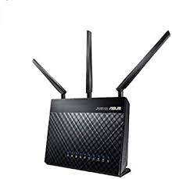

    

<h3 align="center">ASUS Merlin for DSL-AC68U</h3>

  A powerful third party alternative firmware for DSL-AC68U Asus routers.
   
  <a href="https://github.com/RMerl/asuswrt-merlin/wiki"><strong>Explore Asus Merlin docs»</strong></a>
   
   
  <a href="https://github.com/gnuton/asuswrt-merlin.ng/releases/latest">Download latest firmware</a>
  ·
  <a href="https://github.com/gnuton/asuswrt-merlin.ng/issues/new?assignees=&labels=enhancement&template=feature_request.md">Request feature</a>
  ·
  <a href="https://github.com/gnuton/asuswrt-merlin.ng/issues/new?assignees=&labels=bug&template=bug_report.md">Report bug</a>
  ·
  <a href="https://www.snbforums.com/threads/asuswrt-merlin-builds-for-dsl-routers.55985/">Support forum</a>
  ·
  <a href="https://gitter.im/asuswrt/merlin-dsl">Chat</a>

---------------------

### Status
Latest release:
 

All releases:

Latest Merlin firmware version: 

Main branch build: 

### Experimental branches
* [REPEATER MODE](https://github.com/gnuton/asuswrt-merlin.ng/tree/dsl-feature-repeater)
* [IP SEC](https://github.com/gnuton/asuswrt-merlin.ng/tree/dsl-feature-ipsec)

### Contribute
More info [here](https://github.com/gnuton/asuswrt-merlin.ng/blob/master/CONTRIBUTE.md).

### Thanks
- to Asus for the GPL releases
- Upstream Asus Merlin devs

